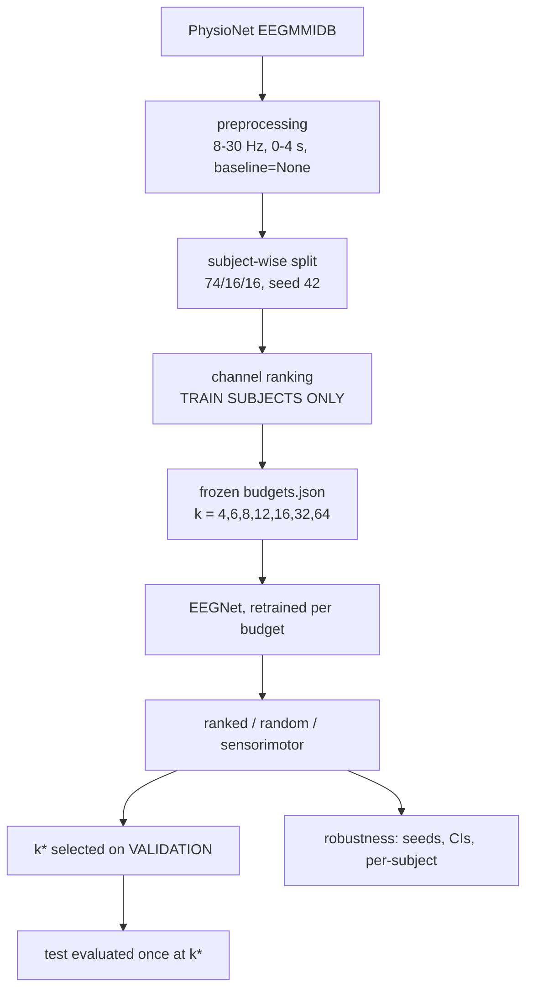

# min-viable-eeg
# Minimum Viable EEG

How far can scalp EEG channel count be reduced before motor-imagery decoding
stops working? This repository contains a frozen preprocessing and
channel-ranking pipeline, a canonical experiment runner, and an analysis layer
that answers that question with a stated selection rule and provenance-stamped
results.

The pipeline is complete and tested. **The sweep has not been run.** See
[Current experimental status](#current-experimental-status) — no κ values exist
in this repository yet, and nothing here should be cited as a result.

---

## Research question

We measure the **effective channel budget** of scalp motor-imagery EEG
decoding: how far the electrode count can fall while retaining a stated
fraction of full-montage performance.

This is deliberately not the claim that motor imagery *requires* k electrodes.
Scalp electrodes sit outside the skull, and volume conduction smears each
cortical source across a wide patch of scalp, so neighbouring channels partly
re-measure the same signal. 64 scalp channels carry far fewer than 64
independent signals. k* is therefore a property of the instrument under volume
conduction, not a fact about how many brain regions motor imagery engages.

The contrast that makes this sharp: invasive local field potential work uses
roughly 16 electrodes and those are *not* redundant, because each samples
distinct tissue. There the count is set by how many sites you want to resolve.
On the scalp it is set by how much redundancy volume conduction creates.

## Core definition

```
k*(τ) = min{ k : κ_k ≥ τ · κ_full }
```

- Primary threshold: **τ = 0.90**
- Sensitivity: τ ∈ {0.85, 0.90, 0.95}
- **k\* is selected on validation. The test split is evaluated once, at the
  already-selected k\*.**

That last rule is enforced in code, not by discipline. `select_kstar()` raises
`TestSetSelectionError` if handed a test row, and `test_report()` takes k\* as
an argument specifically so it has no search over budgets.

If k\* moves across training seeds or across thresholds, the budget curve with
confidence intervals is the result and the analysis says so explicitly — see
the `verdict` field in `kstar_report.json`.

## Why this matters

Research EEG uses 64–128 gel electrodes, a trained operator, and 20+ minutes of
setup. Consumer and clinical devices have 4–8 dry electrodes and no operator.
The gap between those two regimes is the difference between a laboratory result
and something a person can use at home. Knowing where decoding actually
degrades tells you which side of that gap a paradigm falls on.

The general form of the question recurs well outside EEG: how cheap can an
instrument get before the measurement silently stops being the same
measurement. Feature selection, sensor placement, model compression and coreset
selection are all asking it.

## Dataset

PhysioNet EEG Motor Movement/Imagery Database (EEGMMIDB), runs 4, 8 and 12.
Two classes from the imagery annotations: T1 = left fist, T2 = right fist. Rest
(T0) is discarded.

Of 109 subjects, three are excluded (S088, S092, S100), leaving **106 usable
subjects**, split subject-wise at seed 42 into **74 train / 16 validation /
16 test**. 318 EDF files, 4,750 trials, every file verified at 160 Hz and
64 channels.

Twenty runs across ten subjects drop their final epoch because the 4-second
window overruns the end of the recording; S104R08 is an outright truncated
recording (~106 s). The loader handles this by taking labels from post-drop
events, so X and y stay aligned and those subjects simply have 42–44 trials
instead of 45.

## Pipeline



## Experimental conditions

| Condition | What it is | Why it's in the matrix |
| --- | --- | --- |
| **Full montage** | 64 channels, 5 seeds | Establishes κ_full, the denominator for everything else |
| **Ranked** | Frozen top-k from `budgets.json` | The headline arm |
| **Random** | 20 seeded random subsets per budget | Volume conduction predicts a spread random subset is already a strong baseline; "informed beats random" must be won, not assumed |
| **Sensorimotor** | Frozen ranking restricted to a declared 17-electrode strip | Tests whether the signal is motor ERD or cue-correlated — see below |
| **Distillation** | scratch / distill / shuffled-teacher | Extension. A gain over scratch only means transfer if it does *not* also appear against a teacher trained on shuffled labels |

The sensorimotor arm exists because of a real finding in `stability.json`. In
the unrestricted ranking, C3 — the canonical left motor electrode — does not
enter until rank 23, while F7, AF7, PO7 and O1 (frontal-temporal and occipital)
outrank it. Those are plausibly lateralised gaze or attention correlates of the
cue rather than motor cortex. Restricted-versus-unrestricted at equal budget
separates the two, and both outcomes are informative: if they match, the
montage recommendation is clean; if unrestricted wins via occipital channels,
that is a finding about what motor-imagery benchmarks actually measure.

## Leakage prevention

Every one of these is enforced somewhere a test can fail, not just documented.

- **Subject-wise splits.** No subject appears in two splits. Trials from one
  person never straddle the train/test boundary.
- **Train-only normalisation.** Per-channel statistics are fitted on training
  data and applied unchanged to validation and test.
- **Train-only channel ranking.** The Fisher-score ranking is computed on the
  74 training subjects only, and a test proves it is unaffected by val/test
  data.
- **Frozen channel artifacts.** `budgets.json` fixes the exact channel set per
  budget. A drift guard runs before every ranked training run, so a run cannot
  silently train on channels that disagree with the frozen file.
- **Model selection is separated from budget selection.** Early stopping uses a
  15% inner subset of the *training* subjects. The validation split is reserved
  for choosing k\*, so the two selections never share data.
- **Validation-only k\*.** Enforced by exception, as described above.
- **Test used once.** Test rows are produced by the sweep but reach the
  analysis only through `test_report()`, at a k\* chosen without them.

## Reproducibility

Four artifacts are generated once and then frozen. Their writers refuse to
overwrite; regenerating requires deleting the file by hand.

| Artifact | Contents |
| --- | --- |
| `splits.json` | The 74/16/16 subject-wise split |
| `channel_ranking.json` | All 64 channels ranked, with Fisher scores |
| `budgets.json` | Exact channel set per budget, ranking and montage order |
| `stability.json` | Bootstrap inclusion frequency and per-subject overlap |

Each carries its own provenance (git commit, config hash, UTC timestamp). All
four agree with each other, and `tests/test_protocol_integrity.py` checks their
*contents* against the config the runner reads — splits against the split
config, budgets against `budgets` and `reduction_mode`, the ranking band
against the bandpass.

Their recorded `config_hash` predates the training hyperparameters
(`model`, `training`, `distillation`, `sweep`) that the runner needs, so it no
longer equals the current whole-file hash. That is expected and not drift: none
of those keys can change what a frozen artifact contains. `protocol_hash()`
covers only the sections that could — `dataset`, `preprocess`, `splits`,
`budgets`, `reduction_mode` — and is the value to watch.

Every result row records the git commit, config hash, exact channel list,
training seed, selection seed, split, runtime and environment. The manifest is
generated once and sharded deterministically, so four people running
`--shard-id 0..3 --num-shards 4` cover the matrix exactly once with no
coordination.

## Repository structure

```
src/
  loader.py      EDF → epochs. Bandpass on continuous data, baseline=None
  splits.py      Subject-wise split writer (generated once)
  normalize.py   Per-channel stats, train-only by construction
  ranking.py     Fisher-score channel ranking (generated once)
  budget.py      Top-k selection and physical channel subsetting
  stability.py   Bootstrap and per-subject ranking analysis
  channels.py    Unified ranked/random/sensorimotor selection + drift guard
  dataset.py     Subject-indexed split assembly from the cache
  eegnet.py      EEGNet-style CNN
  training.py    Training loop, prediction, device selection
  metrics.py     Pooled and per-subject κ, accuracy, macro-F1
  runner.py      One condition in, one result row out
  kstar.py       k* selection — validation only, by construction
  analysis.py    Stability, ranked-vs-random, follow-up conditions, coverage
  manifest.py    Condition matrix and deterministic sharding

scripts/
  download_data.py       Fetch EDFs from PhysioNet
  cache_preprocessed.py  Write data/processed/S###/{X,y}.npy
  run_sweep.py           The experiment CLI
  analyze.py             k*, stability, ranked-vs-random, follow-ups

paper/
  conclusion.md          Draft (placeholders pending results)
  future_work.md         Extensions
```

## Quick start

```bash
git clone https://github.com/jaw039/min-viable-eeg
cd min-viable-eeg
python -m venv .venv && source .venv/bin/activate
pip install -r requirements.txt

pytest -q                              # 199 passed, 6 skipped

python scripts/download_data.py        # EDFs from PhysioNet
python -m src.inventory                # verify 160 Hz / 64 ch per file
python scripts/cache_preprocessed.py   # → data/processed/

python scripts/run_sweep.py --smoke-test   # one k=8 val row, few epochs
```

Then the sweep. **Validation first, all of it, before test is touched at all.**

```bash
# Pre-sweep anchors: does the instrument demonstrably work?
python scripts/run_anchors.py --out results/anchor_report.json

# 1. Validation manifest and sweep (sharded across machines)
python scripts/run_sweep.py --write-manifest       # validation conditions
python scripts/run_sweep.py --manifest --shard-id 0 --num-shards 4

# 2. Validation analysis -> writes results/kstar_report.json
python scripts/analyze.py --results 'results/*.jsonl'

# 3. Read k* off that report. Then build the RESTRICTED confirmatory
#    test manifest -- ranked/scratch at k* and the 64-channel reference only.
python scripts/run_sweep.py --write-test-manifest --kstar 8 \
    --kstar-report results/kstar_report.json

# 4. Inspect it before spending compute
cat manifests/manifest_test.jsonl

# 5. Run the confirmatory conditions, then report once
python scripts/run_sweep.py --manifest --split test --shard-id 0 --num-shards 1
python scripts/analyze.py --results 'results/*.jsonl' --test-report
```

The test manifest is built by a different command from the validation manifest,
on purpose. `--write-manifest --split test` used to produce the entire control
matrix — random subsets, sensorimotor, distillation, shuffled teacher, label
shuffle — on the split reserved for reporting. That command now exits with a
pointer to `--write-test-manifest`, which emits only ranked/scratch rows at k\*
plus the full-montage reference, refuses to run without an explicit `--kstar`,
and rejects a k\* that was never swept.

Do not change `config.yaml` between the full-montage runs and the reduced-budget
runs. Every ratio in the paper divides by κ_full, and a config change mid-sweep
makes those ratios incomparable.

## Running on Kaggle

Step-by-step runbook: [KAGGLE.md](KAGGLE.md). Summary:

The runner detects `/kaggle/working` and writes there; nothing is hard-coded to
a user directory.

1. **Phone-verify the account.** GPUs and internet are gated behind it.
2. **Upload one private Dataset** with `data/processed/` plus the four frozen
   artifacts. Invite collaborators so every account reads the same versioned
   copy. Pin the dataset version in every run.
3. **Pin the code** to a commit — a zipped snapshot as a second dataset, or a
   clone with a fine-grained token in Kaggle Secrets. Never "latest main."
4. **Settings → Environment → "Original."** "Latest" silently changes your
   dependencies mid-project.

   ⚠️ `mne==1.8.0` imports `scipy.special.sph_harm`, which newer scipy removed.
   Install from `requirements.txt` with the pins honoured or `import mne` fails
   outright.
5. **Accelerator: T4 ×2.** Same quota meter as P100, two GPUs per quota-hour.
   30 GPU-hours per account per week, resetting Saturday 00:00 UTC.
6. Run the smoke test, then launch a shard. Stop sessions from the Active
   Events panel — the meter runs while a session is open even when idle.
7. `/kaggle/working` holds up to 20 GB, and one notebook's output can be
   attached as another's input.

Time one real 64-channel run before planning. EEGNet is tiny and the dataset is
4,750 trials, so the full matrix is plausibly 10–40 GPU-hours — but that is an
estimate, not a measurement, and if a single run takes an hour instead of
minutes the plan changes.

## Result schema

One JSON row per run, appended to JSONL:

```json
{
  "budget_k": 8,
  "selection": "ranked",
  "selection_seed": null,
  "training": "scratch",
  "train_seed": 42,
  "split": "val",
  "channels": ["FC4", "C2", "C4", "C6", "CP4", "CP6", "AF7", "F7"],
  "n_channels": 8,
  "kappa": 0.0,
  "kappa_macro_subject": 0.0,
  "kappa_macro_subject_std": 0.0,
  "accuracy": 0.0,
  "macro_f1": 0.0,
  "n_trials": 720,
  "n_subjects": 16,
  "kappa_per_subject": {"S007": 0.0, "S012": 0.0},
  "n_trials_per_subject": {"S007": 45, "S012": 45},
  "git_commit": "...",
  "config_sha256": "...",
  "aggregation_primary": "pooled",
  "environment": "python3.12.3 torch2.13.0 ...",
  "device": "cuda",
  "runtime_sec": 26.06
}
```

Two design notes. **Both κ aggregations are stored** — pooled over trials and
macro over per-subject κ — because which belongs in the denominator of k\* is a
methodological choice, and storing both makes it revisable after the sweep
without re-running anything. **`kappa_per_subject` is never averaged away**, so
population heterogeneity and near-chance subjects stay analysable later. BCI
populations are famously bimodal; a mean over 16 test subjects can describe
nobody.

## Tests

`pytest -q` → **199 passed, 6 skipped**. The 6 skips are the data-dependent cases in `tests/test_loader.py`, which need the PhysioNet EDFs on disk; they skip with "data missing — run scripts/download_data.py first". Nothing in the experiment path (cache → runner → analysis) requires them.

Some of these are ordinary correctness tests. Others exist because failing them
silently would invalidate the study:

| Test | What it prevents |
| --- | --- |
| `test_ranked_selection_matches_frozen_budgets_at_every_k` | Training on a channel set that disagrees with the frozen artifact — the headline claim would describe a montage that was never trained |
| `test_kstar_refuses_test_rows` | Test-set budget selection wearing a definition as a disguise |
| `test_kstar_has_no_silent_fallback_when_full_montage_missing` | A missing κ_full quietly widening the search to whatever data is available |
| `test_kstar_per_seed_exposes_instability` | A headline integer that is really a seed artifact |
| `test_report_on_test_cannot_choose_kstar` | Scanning the test curve and reporting the smallest passing budget |
| `test_sensorimotor_selection_stays_inside_declared_pool` | A "restricted" control that isn't restricted |
| `test_ranked_vs_random_reports_resolution_floor` | Reading p = 0.048 from 20 subsets as significance when it is the floor |
| `test_per_subject_metrics_are_preserved` | Averaging away the subject-level distribution |
| `test_coverage_report_detects_incomplete_sweep` | Methods describing the planned sweep while Results come from the one that finished |
| `test_splits_are_disjoint_and_exclude_the_excluded` | Subject leakage across splits |

## Current experimental status

**Implemented and tested.** Preprocessing, splits, normalisation, caching,
channel ranking, budget freezing, stability analysis, channel selection
(all three modes) with its drift guard, EEGNet, training loop with inner-split
early stopping, distillation, the runner, manifest and sharding, k\* selection,
and post-sweep analysis.

**Not implemented.** Methods generation (`src/protocol.py`). The Methods
section is written by hand for now; there is no generator, and nothing in the
repo emits `paper/methods_generated.md`.

**Verified on synthetic data only.** The whole path — `run_sweep.py
--write-manifest`, four shards, then `analyze.py` — was exercised against a
synthetic cache built with the real montage, the real 74/16/16 split and a
class-dependent signal planted on C4 alone. Ranked k=8 emitted exactly the
frozen `budgets.json` set; ranked and sensorimotor arms scored κ = 1.00 while
random subsets excluding C4 scored ≈ 0, which is what proves channel selection
genuinely gates model input. Two guards fired on their own: the drift guard
against a corrupted `budgets.json`, and `select_kstar` refusing to compute a
ratio when the synthetic full-montage run produced a non-positive κ_full.
**None of these numbers are science.**

**Pending compute.** Every experimental condition. No κ value from real EEG
exists in this repository. The 691-condition manifest is committed at
`manifests/manifest_val.jsonl` but has not been executed.

**Wired but unvalidated on real data.** Distillation runs (`--training distill`)
and so does its control (`--training distill_shuffled_teacher`), which distils
from a teacher trained on permuted labels. Soft targets regularise regardless
of what the teacher knows, so a gain over scratch only supports "knowledge
transfer" if it does *not* also appear against that sham teacher; `analyze.py`
reports both and says which reading the numbers support. Teachers are trained
per seed and cached; no pre-trained checkpoint is committed or reused.

**Unresolved.** `reduction_mode: reduce` is in the config but not on the locked
protocol list. The 17-electrode sensorimotor pool declared in `src/channels.py`
is a proposal awaiting sign-off. Both are marked `[UNRESOLVED]` where they
appear, and should be settled before Methods is written.

## Limitations

- **Subject heterogeneity.** 52 of 74 training subjects share no electrode with
  the shared top-4, and C4 sits at chance in personal top-16 lists. With ~45
  trials per subject this mixes genuine heterogeneity with estimation noise, and
  the present analysis cannot separate the two.
- **Possible cue or gaze contamination.** C3 enters the ranking only at rank 23
  while frontal and occipital channels outrank it. Part of the discriminative
  signal may be lateralised gaze or attention rather than motor ERD. The
  sensorimotor arm addresses this; a closed-loop replication would settle it.
- **The k=4 montage is not uniquely determined.** C4 appears in 85% of bootstrap
  resamples; the other three members appear ~50–58% and are interchangeable with
  F7/PO7/AF7. Describe it as "C4 plus three right-centroparietal neighbours."
- **Limited trials per subject.** ~45 trials each caps how well any per-subject
  quantity can be estimated.
- **One dataset, one paradigm.** The curve may be a property of EEGMMIDB as much
  as of scalp EEG.
- **Uncertainty in the exact integer.** With 5 seeds the window between adjacent
  budgets can be narrower than the noise. The curve may be more stable than k\*.
- **Offline evaluation.** κ here is an upper bound on closed-loop performance.
- **EEGNet-style, not a faithful port.** No max-norm constraints on the spatial
  or classifier layers; kernel length 64 rather than fs/2 = 80.

## Reproducing a paper number

Any reported number traces back through its result row:

1. `git_commit` → the exact code
2. `config_sha256` → the exact configuration, including all locked and
   unresolved choices
3. `channels` → the exact electrodes trained on, verifiable against
   `budgets.json`
4. `train_seed` and `selection_seed` → the exact run
5. `split` → whether it is validation or test
6. `budget_k` + `selection` + `training` → the experimental condition

For a k\* claim specifically: `kstar_report.json` records the validation budget
curve it was chosen from, the per-seed k\* values, the threshold sensitivity,
and the stability verdict. Check the coverage report in the same file to
confirm which conditions actually ran, and write Methods against that rather
than against the manifest.

## Citation

Dataset:

> Schalk, G., McFarland, D.J., Hinterberger, T., Birbaumer, N., Wolpaw, J.R.
> (2004). BCI2000: A General-Purpose Brain-Computer Interface (BCI) System.
> *IEEE Transactions on Biomedical Engineering*, 51(6), 1034–1043.

> Goldberger, A., et al. (2000). PhysioBank, PhysioToolkit, and PhysioNet.
> *Circulation*, 101(23), e215–e220.

Architecture:

> Lawhern, V.J., Solon, A.J., Waytowich, N.R., Gordon, S.M., Hung, C.P., Lance,
> B.J. (2018). EEGNet: A Compact Convolutional Neural Network for EEG-based
> Brain-Computer Interfaces. *Journal of Neural Engineering*, 15(5), 056013.
